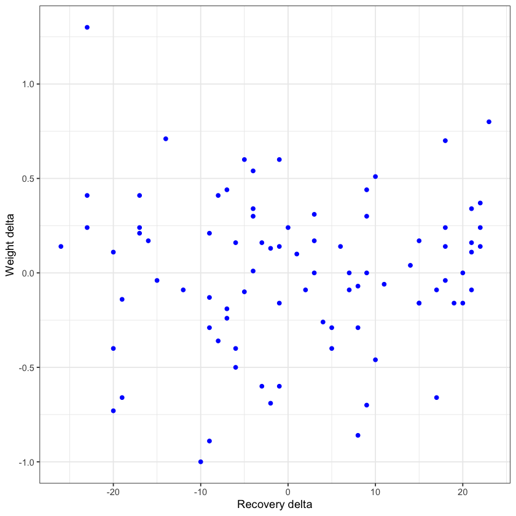

# Sleep and weight analysis in R

Morning weight and sleep duration correlations. I was using very accurate data
from my watch with my weight records. As my diet is very constant I 
was able to avoid noice and biases about morening weight.
Before the analysis I beliebed that it's a negative correlation between sleep duration
and morning weight. But as a result I found no dependence between them.
I used a lot of cleaning data, because it was preatty messy and separated.
I used everyweek median and average to have updated values for each day. 


## Skills applied

R, Data cleaning, Data preparation, Data importing, Visualization in R, Statistics


## Features

- ggplot
- fread
- correlation
- string functions 
- joining tables


## R code
```{r}
#Creating a plot to visualize relationships between weight and recovery deltas
ggplot(big_table, (aes(x = recovery_dif))) + 
geom_point(aes(y = weight_dif), color= "blue") +
theme_bw() +
labs(x = "Recovery delta", y = "Weight delta")

```





```{r}
#Correlation between weight  and sleep (differences)
cor(big_table$weight_dif, big_table$sleep_dif)

```
0.124754596054441


## Instructions 

To see the whole code go to Sleep.Analysis.md
    
