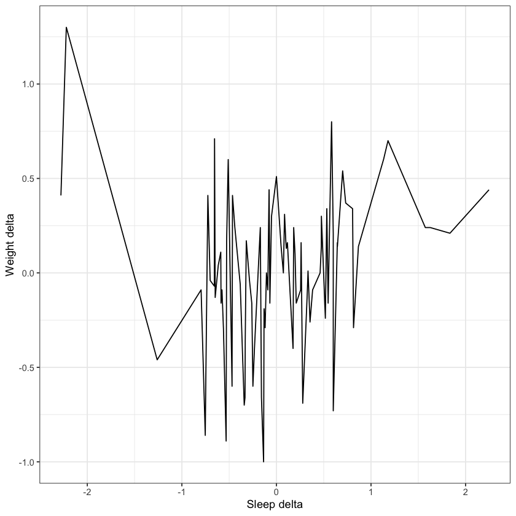

```R
install.packages(c("readr", "dplyr", "data.table", "timechange", "stringr", "lubridate", "ggplot2", "scales", "janitor", "devtools"))

library(readr)
library(dplyr)
library(data.table)
library(timechange)
library(stringr)
library(lubridate)
library(ggplot2)
library(scales)
library(devtools)
install_github("ProcessMiner/nlcor")
library(nlcor)
```

    
    The downloaded binary packages are in
    	/var/folders/dz/2djfbpx56bl18bsf7qtl8x840000gn/T//Rtmp86707e/downloaded_packages


    
    Attaching package: ‘dplyr’
    
    
    The following objects are masked from ‘package:stats’:
    
        filter, lag
    
    
    The following objects are masked from ‘package:base’:
    
        intersect, setdiff, setequal, union
    
    
    
    Attaching package: ‘data.table’
    
    
    The following objects are masked from ‘package:dplyr’:
    
        between, first, last
    
    
    
    Attaching package: ‘lubridate’
    
    
    The following objects are masked from ‘package:data.table’:
    
        hour, isoweek, mday, minute, month, quarter, second, wday, week,
        yday, year
    
    
    The following objects are masked from ‘package:base’:
    
        date, intersect, setdiff, union
    
    
    
    Attaching package: ‘scales’
    
    
    The following object is masked from ‘package:readr’:
    
        col_factor
    
    
    Loading required package: usethis
    
    Skipping install of 'nlcor' from a github remote, the SHA1 (92d4aa3c) has not changed since last install.
      Use `force = TRUE` to force installation
    


```R
sleep_data <- fread("/Users/daniel/Desktop/HKCategoryTypeIdentifierSleepAnalysis_2022-06-168_17-55-08_SimpleHealthExportCSV.csv")
```


```R
#Checking my table
head(sleep_data, 5)
```


<table class="dataframe">
<caption>A data.table: 5 × 12</caption>
<thead>
	<tr><th scope=col>type</th><th scope=col>sourceName</th><th scope=col>sourceVersion</th><th scope=col>productType</th><th scope=col>device</th><th scope=col>startDate</th><th scope=col>endDate</th><th scope=col>value</th><th scope=col>HKTimeZone</th><th scope=col>HKMetadataKeySyncVersion</th><th scope=col>WHOOP Recovery</th><th scope=col>HKMetadataKeySyncIdentifier</th></tr>
	<tr><th scope=col>&lt;chr&gt;</th><th scope=col>&lt;chr&gt;</th><th scope=col>&lt;chr&gt;</th><th scope=col>&lt;chr&gt;</th><th scope=col>&lt;lgl&gt;</th><th scope=col>&lt;dttm&gt;</th><th scope=col>&lt;dttm&gt;</th><th scope=col>&lt;chr&gt;</th><th scope=col>&lt;chr&gt;</th><th scope=col>&lt;int&gt;</th><th scope=col>&lt;int&gt;</th><th scope=col>&lt;chr&gt;</th></tr>
</thead>
<tbody>
	<tr><td>HKCategoryTypeIdentifierSleepAnalysis</td><td>Daniel 💪           </td><td>15.1</td><td>iPhone12,5</td><td>NA</td><td>2022-01-03 07:04:16</td><td>2022-01-03 15:30:01</td><td>inBed </td><td>America/Los_Angeles</td><td>NA</td><td>NA</td><td></td></tr>
	<tr><td>HKCategoryTypeIdentifierSleepAnalysis</td><td>Apple Watch — Даниил</td><td>8.3 </td><td>Watch6,2  </td><td>NA</td><td>2022-01-03 07:11:53</td><td>2022-01-03 12:08:53</td><td>asleep</td><td>America/Los_Angeles</td><td>NA</td><td>NA</td><td></td></tr>
	<tr><td>HKCategoryTypeIdentifierSleepAnalysis</td><td>Apple Watch — Даниил</td><td>8.3 </td><td>Watch6,2  </td><td>NA</td><td>2022-01-03 12:19:53</td><td>2022-01-03 15:41:53</td><td>asleep</td><td>America/Los_Angeles</td><td>NA</td><td>NA</td><td></td></tr>
	<tr><td>HKCategoryTypeIdentifierSleepAnalysis</td><td>Apple Watch — Даниил</td><td>8.3 </td><td>Watch6,2  </td><td>NA</td><td>2022-01-03 15:43:53</td><td>2022-01-03 15:53:23</td><td>asleep</td><td>America/Los_Angeles</td><td>NA</td><td>NA</td><td></td></tr>
	<tr><td>HKCategoryTypeIdentifierSleepAnalysis</td><td>Apple Watch — Даниил</td><td>8.3 </td><td>Watch6,2  </td><td>NA</td><td>2022-01-03 16:01:23</td><td>2022-01-03 16:59:23</td><td>asleep</td><td>America/Los_Angeles</td><td>NA</td><td>NA</td><td></td></tr>
</tbody>
</table>


```R
#filtering for data that is useful
sleep_data_whoop_asleep <- sleep_data %>%
filter(sourceName == "WHOOP", value == "asleep", startDate > 2022-01-03) 
sleep_data_whoop_asleep <- subset(sleep_data_whoop_asleep, select = c("startDate" , "endDate", "WHOOP Recovery")) %>% 
janitor::clean_names()

```


```R
str(sleep_data_whoop_asleep)


```

    Classes ‘data.table’ and 'data.frame':	684 obs. of  3 variables:
     $ start_date    : POSIXct, format: "2022-03-23 06:48:45" "2022-03-23 08:58:39" ...
     $ end_date      : POSIXct, format: "2022-03-23 08:48:03" "2022-03-23 13:24:40" ...
     $ whoop_recovery: int  63 63 48 45 45 45 80 80 79 79 ...
     - attr(*, ".internal.selfref")=<externalptr> 


```R
# The date and time data isn't understandable (I sleep at night)

# Checking one day and try to figure out what is going on
sleep_data_whoop_asleep %>%
filter(between(start_date, '2022-05-01', '2022-05-03'))  %>%
arrange(start_date) 

```


<table class="dataframe">
<caption>A data.table: 24 × 3</caption>
<thead>
	<tr><th scope=col>start_date</th><th scope=col>end_date</th><th scope=col>whoop_recovery</th></tr>
	<tr><th scope=col>&lt;dttm&gt;</th><th scope=col>&lt;dttm&gt;</th><th scope=col>&lt;int&gt;</th></tr>
</thead>
<tbody>
	<tr><td>2022-05-01 06:21:46</td><td>2022-05-01 07:15:41</td><td>54</td></tr>
	<tr><td>2022-05-01 07:18:04</td><td>2022-05-01 08:33:42</td><td>54</td></tr>
	<tr><td>2022-05-01 08:36:06</td><td>2022-05-01 10:12:29</td><td>54</td></tr>
	<tr><td>2022-05-01 10:14:23</td><td>2022-05-01 10:43:46</td><td>54</td></tr>
	<tr><td>2022-05-01 10:57:17</td><td>2022-05-01 11:09:20</td><td>54</td></tr>
	<tr><td>2022-05-01 11:10:46</td><td>2022-05-01 11:59:57</td><td>54</td></tr>
	<tr><td>2022-05-01 12:01:25</td><td>2022-05-01 12:34:46</td><td>54</td></tr>
	<tr><td>2022-05-01 12:36:41</td><td>2022-05-01 13:45:09</td><td>54</td></tr>
	<tr><td>2022-05-01 13:48:59</td><td>2022-05-01 13:54:46</td><td>54</td></tr>
	<tr><td>2022-05-02 06:09:31</td><td>2022-05-02 06:20:06</td><td>82</td></tr>
	<tr><td>2022-05-02 06:22:01</td><td>2022-05-02 07:00:35</td><td>82</td></tr>
	<tr><td>2022-05-02 07:02:59</td><td>2022-05-02 07:06:22</td><td>82</td></tr>
	<tr><td>2022-05-02 07:08:45</td><td>2022-05-02 07:31:53</td><td>82</td></tr>
	<tr><td>2022-05-02 07:35:44</td><td>2022-05-02 08:27:54</td><td>82</td></tr>
	<tr><td>2022-05-02 08:29:50</td><td>2022-05-02 08:35:37</td><td>82</td></tr>
	<tr><td>2022-05-02 08:37:32</td><td>2022-05-02 08:40:26</td><td>82</td></tr>
	<tr><td>2022-05-02 08:42:22</td><td>2022-05-02 08:54:55</td><td>82</td></tr>
	<tr><td>2022-05-02 09:00:44</td><td>2022-05-02 09:05:33</td><td>82</td></tr>
	<tr><td>2022-05-02 09:15:40</td><td>2022-05-02 10:15:31</td><td>82</td></tr>
	<tr><td>2022-05-02 10:17:26</td><td>2022-05-02 11:07:11</td><td>82</td></tr>
	<tr><td>2022-05-02 11:09:05</td><td>2022-05-02 11:47:39</td><td>82</td></tr>
	<tr><td>2022-05-02 11:52:32</td><td>2022-05-02 11:59:45</td><td>82</td></tr>
	<tr><td>2022-05-02 12:02:08</td><td>2022-05-02 12:41:39</td><td>82</td></tr>
	<tr><td>2022-05-02 12:43:33</td><td>2022-05-02 13:24:59</td><td>82</td></tr>
</tbody>
</table>


```R
#Calculating the duration of each period
sleep_data_whoop_asleep <-   sleep_data_whoop_asleep %>%
mutate(duration = difftime(end_date, start_date,  units = "hours"))

```


```R
#Changing colums type and names
sleep_duration <- sleep_data_whoop_asleep %>%
mutate(Date = as.Date(start_date), recovery = whoop_recovery) 
#Summarizing data, using mean with recovery doen't impact data, but allows us to add extra column inside the same grouping
sleep_duration <- sleep_duration %>%
group_by(Date) %>%
summarize(sleep = as.numeric(sum(duration)), recovery = mean(recovery))
```


```R
#After checking these time and comparing it with the data in my phone I can make a conclusion:
#The time in this data has a  +7 hours gap (it shows as GMT), so I can just subtract 7 hours 
sleep_data_whoop_asleep$startDate <- time_add(sleep_data_whoop_asleep$start_date, hours =  -7)
sleep_data_whoop_asleep$endDate <- time_add(sleep_data_whoop_asleep$end_date, hours =  -7)
```


```R
head(sleep_data_whoop_asleep, 3)
```


<table class="dataframe">
<caption>A data.table: 3 × 6</caption>
<thead>
	<tr><th scope=col>start_date</th><th scope=col>end_date</th><th scope=col>whoop_recovery</th><th scope=col>duration</th><th scope=col>startDate</th><th scope=col>endDate</th></tr>
	<tr><th scope=col>&lt;dttm&gt;</th><th scope=col>&lt;dttm&gt;</th><th scope=col>&lt;int&gt;</th><th scope=col>&lt;drtn&gt;</th><th scope=col>&lt;dttm&gt;</th><th scope=col>&lt;dttm&gt;</th></tr>
</thead>
<tbody>
	<tr><td>2022-03-23 06:48:45</td><td>2022-03-23 08:48:03</td><td>63</td><td>1.988333 hours</td><td>2022-03-22 23:48:45</td><td>2022-03-23 01:48:03</td></tr>
	<tr><td>2022-03-23 08:58:39</td><td>2022-03-23 13:24:40</td><td>63</td><td>4.433611 hours</td><td>2022-03-23 01:58:39</td><td>2022-03-23 06:24:40</td></tr>
	<tr><td>2022-03-24 06:47:50</td><td>2022-03-24 13:14:39</td><td>48</td><td>6.446944 hours</td><td>2022-03-23 23:47:50</td><td>2022-03-24 06:14:39</td></tr>
</tbody>
</table>


```R
sleep_duration <- sleep_duration %>%
group_by(Date) %>%
mutate(sleep = as.numeric(sleep))
```


```R
head(sleep_duration, 3)
```


<table class="dataframe">
<caption>A grouped_df: 3 × 3</caption>
<thead>
	<tr><th scope=col>Date</th><th scope=col>sleep</th><th scope=col>recovery</th></tr>
	<tr><th scope=col>&lt;date&gt;</th><th scope=col>&lt;dbl&gt;</th><th scope=col>&lt;dbl&gt;</th></tr>
</thead>
<tbody>
	<tr><td>2022-03-23</td><td>6.421944</td><td>63</td></tr>
	<tr><td>2022-03-24</td><td>6.446944</td><td>48</td></tr>
	<tr><td>2022-03-25</td><td>6.421111</td><td>45</td></tr>
</tbody>
</table>


```R
#Creating a table with my weight data (in kg). I store all my data in the "FatSecret" app, but they don't allow you to 
#download your weight data in a file. So I manually copied my mesurements and pasted them into the text file

#Creating R table
weight_table <- read_delim("/Users/daniel/Desktop/study\ case\ 1/weight.txt.txt") 
colnames(weight_table) <- c("Date" , "Weight", "How closely followed")
#I don't need the last column
weight_table <- weight_table %>%
select(-'How closely followed') 
#Changing string to the numeric and date formats
weight_table$Weight <- str_remove_all(weight_table$Weight, pattern = "[:alpha:]") 
#weight_table$Date <- gsub(" ", "", weight_table$Date)
weight_table$Weight <- as.double(weight_table$Weight)
weight_table$Date <- as.Date(weight_table$Date, format = "%d %b %y")
str(weight_table)

```

    Warning message:
    “One or more parsing issues, see `problems()` for details”
    Rows: 165 Columns: 3
    ── Column specification ────────────────────────────────────────────────────────
    Delimiter: "\t"
    chr (3): Date,          Weight,          How closely followed?
    
    ℹ Use `spec()` to retrieve the full column specification for this data.
    ℹ Specify the column types or set `show_col_types = FALSE` to quiet this message.


    tibble [165 × 2] (S3: tbl_df/tbl/data.frame)
     $ Date  : Date[1:165], format: "2022-06-18" "2022-06-17" ...
     $ Weight: num [1:165] 68.6 68.4 68.6 69.1 68.8 68.8 68.8 68.6 69.7 68.8 ...


```R
 weight_table <- weight_table %>%

mutate(week_num = isoweek(Date)) 


#Right now the week starts on Sunday, but I want to calculate average from Wednesday to Wednesday
#Because I sleep more on weekends and calculating the average weight from one standard week can confuse my analysis

#Without sleep affect on these day I would have the lowest(on a diet) or the highest(on bulking) weight , 
#So I want to avoid  wrong potential  correlation
weight_table <- weight_table %>%
mutate(week_num = ifelse(wday(Date) > 4 | wday(Date) == 1, week_num +1, week_num))
```


```R
#Creating a table with the average weight 
weight_table <- weight_table %>%
group_by(week_num) %>%
mutate(avg_weight = round(mean(Weight), 2))
```


```R
median(sleep_duration$sleep)
```


6.88666666666667


```R
big_table <- sleep_duration %>%
inner_join(weight_table, by = "Date") %>%
mutate(sleep_dif = sleep - median(sleep_duration$sleep), weight_dif = avg_weight -  Weight, recovery_dif = recovery - median(sleep_duration$recovery)) 

head(big_table, 3)
```


<table class="dataframe">
<caption>A grouped_df: 3 × 9</caption>
<thead>
	<tr><th scope=col>Date</th><th scope=col>sleep</th><th scope=col>recovery</th><th scope=col>Weight</th><th scope=col>week_num</th><th scope=col>avg_weight</th><th scope=col>sleep_dif</th><th scope=col>weight_dif</th><th scope=col>recovery_dif</th></tr>
	<tr><th scope=col>&lt;date&gt;</th><th scope=col>&lt;dbl&gt;</th><th scope=col>&lt;dbl&gt;</th><th scope=col>&lt;dbl&gt;</th><th scope=col>&lt;dbl&gt;</th><th scope=col>&lt;dbl&gt;</th><th scope=col>&lt;dbl&gt;</th><th scope=col>&lt;dbl&gt;</th><th scope=col>&lt;dbl&gt;</th></tr>
</thead>
<tbody>
	<tr><td>2022-03-23</td><td>6.421944</td><td>63</td><td>71.7</td><td>12</td><td>72.11</td><td>-0.4647222</td><td>0.41</td><td> -8</td></tr>
	<tr><td>2022-03-24</td><td>6.446944</td><td>48</td><td>71.2</td><td>13</td><td>71.44</td><td>-0.4397222</td><td>0.24</td><td>-23</td></tr>
	<tr><td>2022-03-25</td><td>6.421111</td><td>45</td><td>71.3</td><td>13</td><td>71.44</td><td>-0.4655556</td><td>0.14</td><td>-26</td></tr>
</tbody>
</table>


```R
#Creating a line plot to visualize relationships between weight and sleep deltas
ggplot(big_table, (aes(x = sleep_dif))) + 
geom_line(aes(y = weight_dif), color= "black") + 
theme_bw() +
labs(x = "Sleep delta", y = "Weight delta")


```


    

    


```R
#Creating a plot to visualize relationships between weight and recovery deltas
ggplot(big_table, (aes(x = recovery_dif))) + 
geom_point(aes(y = weight_dif), color= "blue") +
theme_bw() +
labs(x = "Recovery delta", y = "Weight delta")


```


    

    


```R
#Correlation between weight  and sleep (differences)
cor(big_table$weight_dif, big_table$sleep_dif)

```


0.124754596054441


```R
#There's no correlation between sleep and weight
```


```R
#Correlation between weight and recovery (differences)
cor(big_table$weight_dif, big_table$recovery_dif)

```


0.0248013931129501


```R
#There's no correlation between recovery and weight
```


```R

```


<table class="dataframe">
<caption>A data.table: 10 × 4</caption>
<thead>
	<tr><th scope=col>whoop_recovery</th><th scope=col>duration</th><th scope=col>startDate</th><th scope=col>endDate</th></tr>
	<tr><th scope=col>&lt;int&gt;</th><th scope=col>&lt;drtn&gt;</th><th scope=col>&lt;dttm&gt;</th><th scope=col>&lt;dttm&gt;</th></tr>
</thead>
<tbody>
	<tr><td>63</td><td>1.98833333 hours</td><td>2022-03-22 23:48:45</td><td>2022-03-23 01:48:03</td></tr>
	<tr><td>63</td><td>4.43361111 hours</td><td>2022-03-23 01:58:39</td><td>2022-03-23 06:24:40</td></tr>
	<tr><td>48</td><td>6.44694444 hours</td><td>2022-03-23 23:47:50</td><td>2022-03-24 06:14:39</td></tr>
	<tr><td>45</td><td>2.11055556 hours</td><td>2022-03-24 23:37:16</td><td>2022-03-25 01:43:54</td></tr>
	<tr><td>45</td><td>0.06388889 hours</td><td>2022-03-25 01:48:15</td><td>2022-03-25 01:52:05</td></tr>
	<tr><td>45</td><td>4.24666667 hours</td><td>2022-03-25 02:09:57</td><td>2022-03-25 06:24:45</td></tr>
	<tr><td>80</td><td>7.78722222 hours</td><td>2022-03-25 23:11:16</td><td>2022-03-26 06:58:30</td></tr>
	<tr><td>80</td><td>1.34694444 hours</td><td>2022-03-26 07:05:16</td><td>2022-03-26 08:26:05</td></tr>
	<tr><td>79</td><td>0.70527778 hours</td><td>2022-03-27 00:12:45</td><td>2022-03-27 00:55:04</td></tr>
	<tr><td>79</td><td>5.42861111 hours</td><td>2022-03-27 00:59:25</td><td>2022-03-27 06:25:08</td></tr>
</tbody>
</table>


